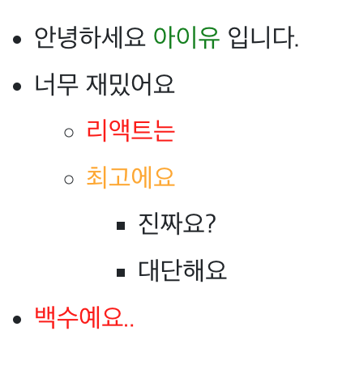
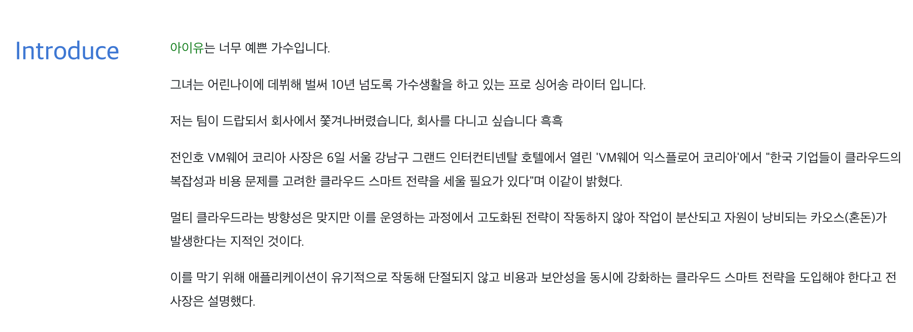
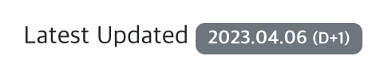
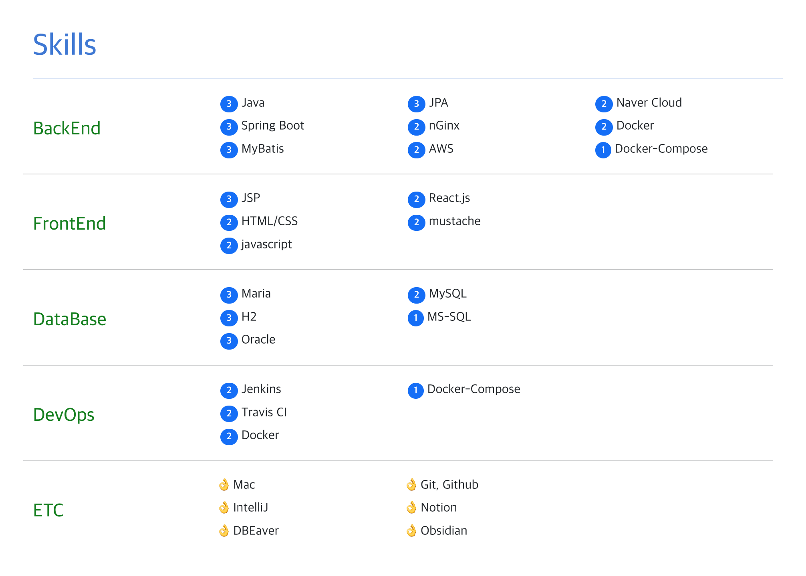
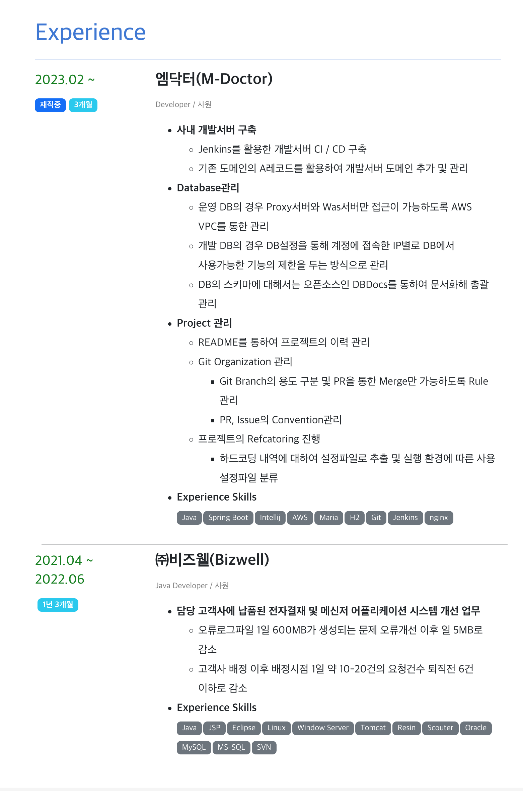
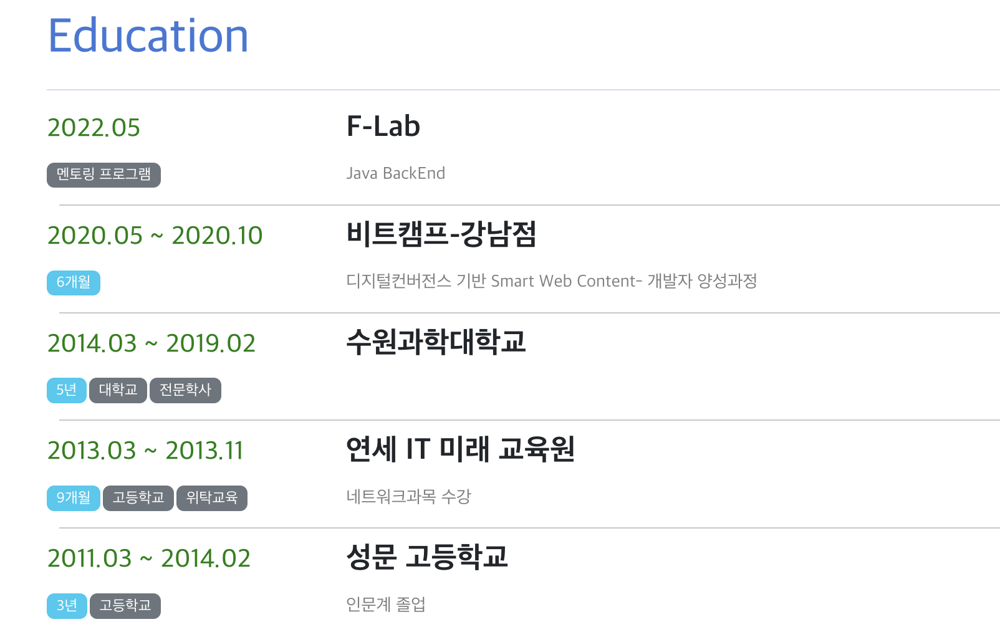

# Resume

## 제작 계기...

[기존 이력서](https://github.com/donsonioc2010/resume2) 같은 경우 fork를 떠와서 적당히 내상황에 맞게 기록을 했던 Resume 이력서 페이지이다.
그러다 보니 TypeScript, React, Next.js에 모두 무지했던 내가 관리하기에는 버거운 이력서가 되버림.

그러다 보니 파일이 꼬였는데.. 어디부터 꼬였는지 모르겠더라...

그런김에 그냥 React를 다시 학습할겸, 내가 보기 편한 Resume를 다시 만들면서 익혀가는게 재밌겠다 생각하여 만들게 된 Resume

---

## Domain

> 아직 서버 안띄웠다...

- [이력서 주소](https://resume.jong1.com)

---

## 생각했던 포인트?

- 코드를 모르는 사람도 이해할 수 있게 최대한 단순하게
- 정보전달은 쉽게

> 단 두가지만 최대한 신경쓰면서 개발을 진행함

---

## Reference

- https://github.com/uyu423/resume-nextjs
  - 아무래도..기존 Resume에 영향을 많이 받았다...
  - 감사합니다..

---

## 사용 Dependency

- React
- Redux
  - React-Redux
- React Bootstrap
- Bootstrap
- FontAweSome

---

## 기능 설명

- Data의 수정은 기본적으로 모두 `./src/data/*.json` 파일을 수정하면 된다.
- **이미지 파일**의 경우에는 `./public/img`에 담고 활용해야 한다.

### Profile

> 해당 메뉴의 하위 JSON파일은 모두 `./src/data/Profile.json`을 칭하도록 한다.

#### 프로필 이미지 수정방법

1. `./public/img/`에 사진 추가
2. **JSON**파일 `profile.img`항목에 파일명을 기록한다.

#### 이름 변경

1. **JSON**파일의 `name.title`, `name.small`을 본인의 명칭에 맞게 수정한다.

#### Contact

- **JSON**파일의 `contact`항목의 경우에는 `이메일`, `전화번호`, `깃허브`, `블로그`, `인스타`, `링크드인`의 순서대로 기록되어 있다.
- 기록하기 싫은 항목에 대해서는 `title`항목에 `''`로 기록을 하게 되면 해당 항목을 표시하지 않는다.
- `link`항목을 `''`또는 `#`으로 기록하게 될 경우 링크로 텍스트를 생성하는 것이 아닌, 일반 `span`태그로 생성된다.

#### Contact Notice

> 남겨놓고 싶은 말을 적을떄 활용하면 된다.

- **JSON**파일의 `infoNotice` 항목의 기록을 하면 된다
- 표시를 하기 싫으면 **JSON**파일에서 `#`또는 `''`으로 표현하면 된다.

---

### Introduce

> 해당 메뉴의 하위 JSON파일은 모두 `./src/data/Introduce.json`을 칭하도록 한다.

#### Type

> 해당 항목은 **JSON**파일에서 `type`항목을 수정해서 변경이 가능하다.

- LIST
  - li형식으로 표현하며 ul in ul 방식으로 무한히 표현은 가능하다.
- 혹은 그 이외 (문장으로 표현한다)
  - 배열로 사용이 가능하며 1차원 배열로만 설정이 가능하다
  - `div`태그로 묶기만 한다.

#### List In List 사용법

- **JSON**파일에서 `introduces`항목의 수정을 하면 되며, `html`을 그대로 기록을 한다.
- 아래의 예제와 스크린샷을 활용해보면 좋을 듯 하다.

> 배열안에 배열을 넣는 것은 **제한**이 없다.

```JSON
"introduces": [
    "안녕하세요 <span style='color:green'>아이유</span> 입니다.",
    "너무 재밌어요",
    [
      "<span style='color:red'>리액트는</span>",
      "<span style='color:orange'>최고에요</span>",
      ["진짜요?","대단해요"]
    ],
    "<span style='color:red'>백수예요..</span>"
  ],
```



#### Sentence

- **JSON**파일에서 `introduces`항목의 수정을 하면 되며, `html`을 그대로 기록을 한다.
- 1차원 배열로만 가능하다
- 아래의 JSON 내용일 경우 그 아래의 스크린샷처럼 예제가 출력된다.

```JSON
"introduces": [
    "<span style='color:green'>아이유</span>는 너무 예쁜 가수입니다.",
    "그녀는 어린나이에 데뷔해 벌써 10년 넘도록 가수생활을 하고 있는 프로 싱어송 라이터 입니다.",
    "저는 팀이 드랍되서 회사에서 쫓겨나버렸습니다, 회사를 다니고 싶습니다 흑흑",
    "전인호 VM웨어 코리아 사장은 6일 서울 강남구 그랜드 인터컨티넨탈 호텔에서 열린 'VM웨어 익스플로어 코리아'에서 \"한국 기업들이 클라우드의 복잡성과 비용 문제를 고려한 클라우드 스마트 전략을 세울 필요가 있다\"며 이같이 밝혔다.",
    "멀티 클라우드라는 방향성은 맞지만 이를 운영하는 과정에서 고도화된 전략이 작동하지 않아 작업이 분산되고 자원이 낭비되는 카오스(혼돈)가 발생한다는 지적인 것이다.",
    "이를 막기 위해 애플리케이션이 유기적으로 작동해 단절되지 않고 비용과 보안성을 동시에 강화하는 클라우드 스마트 전략을 도입해야 한다고 전 사장은 설명했다."
  ],
```



#### Latest Updated

> 해당 기능은 마지막 업데이트가 진행된 일자 및 해당 일자로부터 얼마나 경과하였는지를 표현한다.

- **JSON** 파일에서 `latestUpdatedAt`항목을 `YYYY-MM-DD` 형식에 맞춰 일자를 수정하면 된다.



---

### Skils

> Skills는 `./src/data/Skills.json`의 파일을 수정하면 되며, 기록할게 많이 없어서 그냥 모습이 보이는 스크린샷만 던져 놓도록 하겠다.

> `skillLayer`항목의 경우에는 라인 수를 조절 할 수 있으며, 3개 이상으로 설정해야 정상적으로 출력이 된다. 또한 가장 단정한건 3개~4개 사이로 설정하면 가장 보기좋은 디자인이 된다.

> **theme**, **title**, **level로** 이뤄져있으며 **theme**, **title**은 무조건 기록해주고 level은 기록을 안해도 상관은 없다.



---

### Experience

> 경험탭은 `./src/data/experience.json`을 수정하면 된다.

| columnName          | Null Able | Description                                                                                       |
| :------------------ | :-------: | :------------------------------------------------------------------------------------------------ |
| `experience`        |   false   | 경험여부, 무조건 빈 배열로라도 만들어 둬야한다.                                                   |
| `companyName`       |   false   | 재직했던 회사 명                                                                                  |
| `companyJoinDate`   |   false   | 해당 회사 입사일                                                                                  |
| `companyResignDate` |   true    | 퇴직일, 없으면 금일날짜 기준으로 설정하며, 재직중으로 판단하여 뱃지생성함.                        |
| `companyJob`        |   true    | 재직당시 업무 포지션 , 없으면 표현 안함                                                           |
| `companyPosition`   |   true    | 재직당시 직위, 없으면 표현 안함                                                                   |
| `skills[]`          |   true    | 화시에서 사용했던 기술을 나열, 없으면 표현하지는 않으며, 꼭 배열과 원소는 문자열로 표현해야 한다. |
| `projets[]`         |   false   | 재직당시 했던 기록하고자 하는 업무들, 내부에 배열로 추가적인 리스트로 생성도 가능하다             |



---

### Education

> 받은 교육에 대해서 기록하는 탭으로 `./src/data/Education.json`의 데이터를 변형하면 된다.

| column       |  type  | Null  | Description                                                                                                                               |
| :----------- | :----: | :---: | :---------------------------------------------------------------------------------------------------------------------------------------- |
| `list`       | Array  | true  | 교육수강내역 배열로 기록, 빈배열로 설정하면 아얘 안나옴.                                                                                  |
| `title.main` | String | false | 제목, 학교명등 가장 큰단위를 기록하면 적당하다. 없으면 Row생성이 안됨                                                                     |
| `title.sub`  | String | true  | 부제목, 교과 과정을 적으면 적당하다.없으면 해당 내용은 기록이 안된다.                                                                     |
| `date.start` |  Date  | false | 교육의 시작일, 하루짜리만 기록하고싶으면 해당 항목에 기록하면 되며, 없으면 Row의 생성이 되질 않는다.                                      |
| `date.end`   |  Date  | true  | 교육의 종료일, 해당 일자를 기록한 경우 시작일~종료일의 개월수를 기록해 Badge를 추가한다. 없으면 따로 하지는 않는다                        |
| `tag`        | Array  | true  | 교육의 테마같은 단위를 기록하고싶으면 작성하면 된다. 예를 들어 고등학교라던가? 대학교 등등,항목이 존재하지 않는 경우 기록하지 않아도 된다 |



---

### Footer

> Footer의 경우에는 해당 프로젝트 사용 Framework에 대한 기록, 내가 참고한 Resume, 내 오리지널 Github Link, 혹시나 모를 수정자의 링크정도를 담았다.

> **JSON** 파일의 경우 `./src/data/Footer.json`을 활용한다

> Footer Json의 경우에는 객체가 하나이며, 링크를 연결한다.  
> `Creator Git Repository`라는 명칭으로 `Title`이 설정되어 있으나 희망하지 않는다면 `footer/footer.js`에서 직접 수정하도록 한다.  
> 또한 원본 Git과 참고로 사용한 Resume링크는 출처이므로 남겨주면 좋을 듯 하다... (제 Git도 광고하고싶어요😂)

#### 보여지는 이미지


